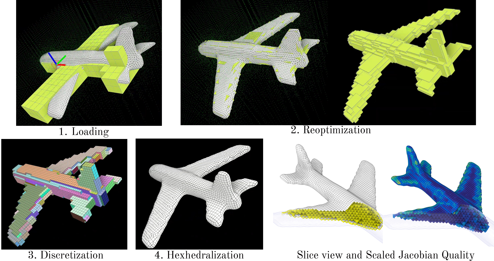

# Docker Environment for EvoCube and Interactive-All-HexMesh
Instructions on setting up the environment for EvoCube and Interactive-All-HexMesh

Authors: Yongqing Liang and Xin Li (Texas A&M University)

## Basic Docker Program and NVIDIA Support

The following instructions are based on the Ubuntu 24.04 LTS and CUDA 12.6 (nvidia-open). A valid GitHub account with git access is required.

### 1 Clone the repository
```
sudo apt install git
git clone --recursive git@github.com:xmlyqing00/AutoHexMesh.git
cd AutoHexMesh
```
### 2 Install Docker Program
```
. ./install_docker.sh
```
<details>
<summary>References</summary>

- https://docs.docker.com/engine/install/ubuntu/
- https://docs.nvidia.com/datacenter/cloud-native/container-toolkit/latest/install-guide.html

</details>

Test Docker (Optional): It should show the GPU information in nvidia-smi.
```
sudo docker run --rm --runtime=nvidia --gpus all ubuntu nvidia-smi
```


## Build the environment

### 1 Setup the host environment and create a Docker image

Our Docker image is based on the **CUDA 12.4** container. It should be less or equal to the version of your host GPU driver version. If not, please check the CUDA container Reference to change the version of NVIDIA container and the LibTorch. 
<details>
<summary>Key Library Versions and References</summary>

- Docker Image based on CUDA 12.4: https://catalog.ngc.nvidia.com/orgs/nvidia/containers/cuda/tags 
- LibTorch 2.6.0: https://pytorch.org/get-started/locally/ 
- Vulkan SDK: downloaded by `setup.sh` from the current official LunarG Linux SDK URL and installed under `lib/vulkan-sdk`

</details>

In the host machine under the folder `AutoHexMesh`, run one command to download
dependencies, build the Docker image, compile both codebases inside Docker, and
run the headless NVIDIA smoke test:
```
./setup.sh
```
For a completely clean Docker-container run, use `./setup.sh --clean-containers`.

### 2 Enter the Docker container

A detailed document of the code structure and parameters can be found in the [Document](DOCUMENT.md).

#### 2.1 Create a Docker container at the first time
In the host machine under the folder `AutoHexMesh`,
```
. ./run_docker.sh
```
Note: `source` is the bash command feature. Using `. ./compile.sh` is more general.
#### 2.2 Resume the container after the first time
In the host machine, you can attach to the container by the following command.
```
sudo docker container list -a
xhost +local:root
sudo docker start [container id]
sudo docker attach [container id]
```

### 3 Compile the code
`setup.sh` already compiles the code inside Docker. Re-run this manually only
after editing C++ source:

In the Docker container under the folder `/space`,
```
. ./compile.sh
```
`compile.sh` sources the Vulkan SDK from `/space/lib/vulkan-sdk` and also applies
local reliability patches from `/space/patches` when needed. These keep a fresh
recursive clone on the public submodule commits while still fixing the known
Evocube `polycube_final.obj` post-processing segfault and the `hex` startup abort
when Vulkan validation layers are unavailable.


## Run the code

### 1 Run the evocube
In the container, to automatically generate polycube in the folder `./data/examples`
```
cd /space/evocube/build
./init_from_folder
```
This pipeline writes the files needed by the next step, especially
`tetra.mesh` and `fast_polycube_surf.obj`. It does not normally write
`polycube_final.obj`; if you see `Skipping final-polycube measurement`, that is
expected and safe.

Or run the labeling module with GUI in the container
```
cd /space/evocube/build
./evolabel /space/data/examples/toy_plane.obj
```

### 2 Convert the polycube to cubes (HDF5 format)
In the container
```python3
cd /space/evocube/
python3 build_hdf5.py --dir /space/output/examples/toy_plane
```

### 3 Run the interactive-hex-meshing
In the container
```
source /space/lib/vulkan-sdk/setup-env.sh
export VK_LAYER_PATH=$VULKAN_SDK/share/vulkan/explicit_layer.d
cd /space/interactive-hex-meshing/bin/Release
./hex
```

For a non-interactive sanity check of the command-line pipeline, run this from
the host after compiling:
```
./cli_run/smoke_test.sh
```
The smoke test defaults to true headless mode and passes only when the final
mesh has `total_hexes > 0` and `inverted_count == 0`.

<details>
<summary>Tips for Vulkan loading errors.</summary>
Vulkan error is common in the Docker container. Please check the following tips to quickly solve the problems.
- Source the Vulkan SDK environment in the container: `source /space/lib/vulkan-sdk/setup-env.sh`.
- Recompiling: always rebuild with `. ./compile.sh`, which sources the bundled SDK above before running cmake/make. Invoking cmake/make directly without that environment can make a recompile fail with Vulkan / `find_package(Vulkan)` errors even though the first build succeeded. Do not `apt install` a system Vulkan into the container as a workaround; a mismatched system loader/ICD can shadow the bundled SDK and cause ICD/loader crashes when you later run `hex`.
- `vulkaninfo --summary` in the container should return basic profile. There should be no error messages in the beginning lines about ICD, drivers or loading issues.
- If there is an ICD error in the GUI container, prefer setting `VK_ICD_FILENAMES` to the intended ICD, for example `/usr/share/vulkan/icd.d/nvidia_icd.json`, instead of editing the host ICD directory.
- For the self-contained Docker image, do not bind-mount the host `/usr/share/vulkan`; let the NVIDIA Container Toolkit inject the runtime driver libraries, or use the slim CPU/headless image with Mesa lavapipe.

</details>

In the pop-up GUI, on the top left, load the HDF5 file generated by the last step.
Follow the instructions of the pipeline to generate the hex mesh.

1. `File` -> `Open` -> `/space/output/examples/toy_plane/evocube.hdf5`
2. `Decomposition` -> `Create anchors ...` -> `Reoptimization`
3. `Discretization` -> `Discretize` -> `Finalize polycube`
4. `Hexhedralization` -> `Init/Finalize hex mesh`

Step by step visualization:

## Clean the Docker environment
In the host machine, remove all containers
```
sudo docker rm -f $(sudo docker ps -aq)
```
In the host machine, remove all images
```
sudo docker rmi -f $(sudo docker images -q)
```

## Copyright

Copyright (c) 2025 Yongqing Liang and Xin Li

<details>
<summary>Citations</summary>

```
@software{Liang_Docker_Environment_for_2025,
    author = {Liang, Yongqing and Li, Xin},
    month = may,
    title = {{Docker Environment for EvoCube and Interactive-All-HexMesh}},
    url = {https://github.com/xmlyqing00/AutoHexMesh},
    version = {1.0},
    year = {2025}
}

@article{dumery:evocube,
   title = {{Evocube: a Genetic Labeling Framework for Polycube-Maps}},
   author = {Dumery, Corentin and Protais, Fran{\c c}ois and Mestrallet, S{\'e}bastien and Bourcier, Christophe and Ledoux, Franck},
   url = {https://doi.org/10.1111/cgf.14649},
   journal = {{Computer Graphics Forum}},
   publisher = {{Wiley}},
   year = {2022},
   month = Aug,
   doi = {10.1111/cgf.14649},
   volume = {41},
   number = {6},
   pages = {467--479},
} 

@article{li2021interactive,
  title={Interactive all-hex meshing via cuboid decomposition},
  author={Li, Lingxiao and Zhang, Paul and Smirnov, Dmitriy and Abulnaga, S Mazdak and Solomon, Justin},
  journal={ACM Transactions on Graphics (TOG)},
  volume={40},
  number={6},
  pages={1--17},
  year={2021},
  publisher={ACM New York, NY, USA}
}
```
</details>
